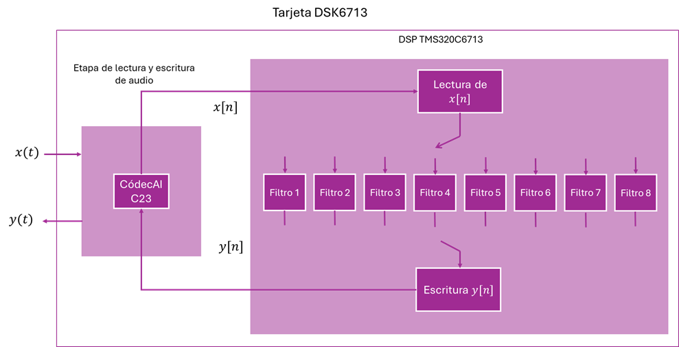

# FIR-FiltersBank
FIR Filters Bank with C for DSK6713 development board

It is coded in C language in the Code Composer Studio IDE and implemented on the DSK6713 development board as a bank of FIR filters to analyze its behavior in audio playback.
## Design and implementation
To design the FIR filter bank, the block diagram in the following figure is taken into account.

The design specifications are following
| Filtro |	fc1 |	fc2 |
| ------ | ---- | --- |
| 1	| 250 Hz	| 500 Hz |
| 2	| 500 Hz	| 875 Hz |
| 3	| 875 Hz	| 1150 Hz |
| 4	| 1150 Hz	| 1450 Hz |
|5	| 1450 Hz |	2000 Hz |
|6	| 2000 Hz	| 2600 Hz |
|7	| 2600 Hz	| 3800 Hz |
|8	| 3800 Hz	| 6800 Hz |

Some considerations:
1. Use the dip switch on the development card to select the filter through which the input signal will pass, and the filtered signal will be obtained.
2. Design a filter bank for each window: (Hamming, Hanning, Kaiser)
3. The number of coefficients is determined by N=251
4. The calculated filter coefficients are stored in a C header file (.h).
5. Use the MATLAB Script to coefficients file
6. Consider the FIR Filter algorithm

       FIR Algorithm
       Variables
         integer N
         float x[N], h[N], yn
       Start
         Repeat For k <- 0 to N
           x[i] <- x[i-1]
         End For
         x[0] <- xn
         yn <- 0
         Repeat For k <- 0 to N-1
           yn <- yn + h[k] * x[k]
         End For
         Return yn
       End

## Results
Srarting with filter responses
* Hamming FIR Filter

* Hanning FIR Filter

* Kaiser FIR Filter

Results of some actual measurements on an oscilloscope

| Ventana | Filtro | Banda de rechazo | Banda de paso |
| ------- | ------ | ---------------- | ------------- |
| Hamming | 250 - 500 Hz | Entrada: 60 Hz	| Entrada: 300 Hz |
| Hanning | 1150 - 1450 Hz | Entrada: 100 Hz | Entrada: 1300 Hz |
| Kaiser | 3800 - 6800 Hz | Entrada: 3500 Hz | Entrada: 5500 Hz |
